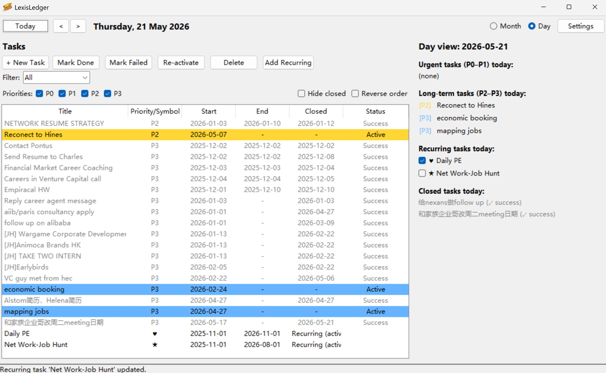
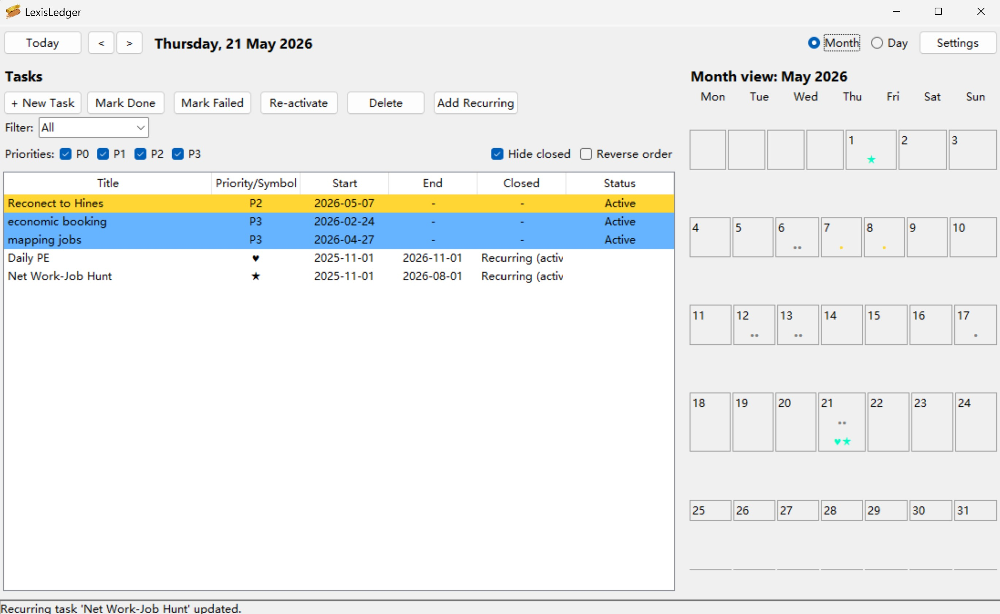
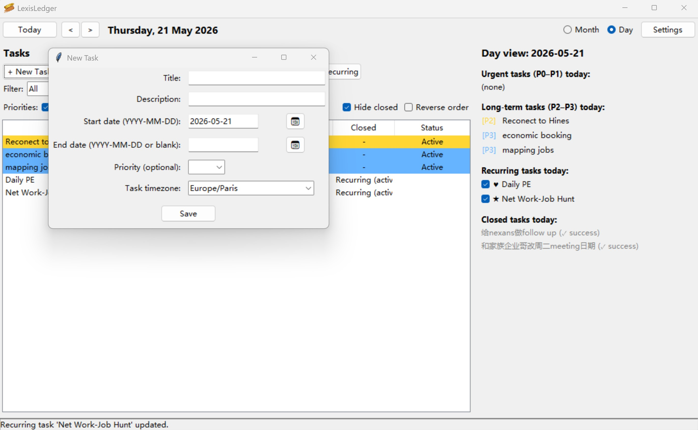
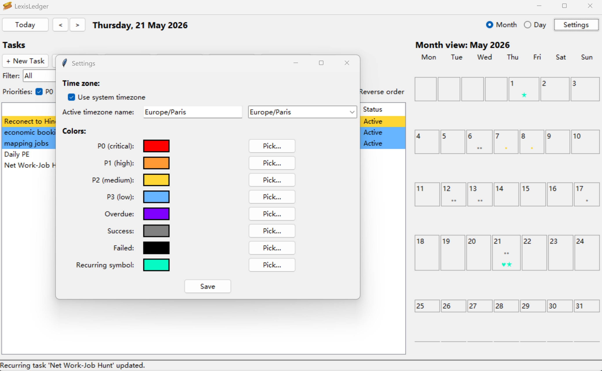

# lexis-ledger
A personal workflow and daily planning tool inspired by project management systems.
I built it to create a cleaner way to manage one-off tasks, recurring tasks, priorities, and day-level planning in a single interface.

## Key features
- One-off and recurring tasks
- Calendar-based planning
- Priority and status tracking
- Day-level task management
- Workflow-oriented structure inspired by PM tools

## Why I built it
I wanted a tool that sits somewhere between a daily planner and a lightweight project management system. The idea was to make personal execution more structured without losing flexibility.

## My role
I designed the concept, workflow logic, and interface structure of the tool.

## Run locally
Open the project files and run:

## Screenshots






```python
python main.py


